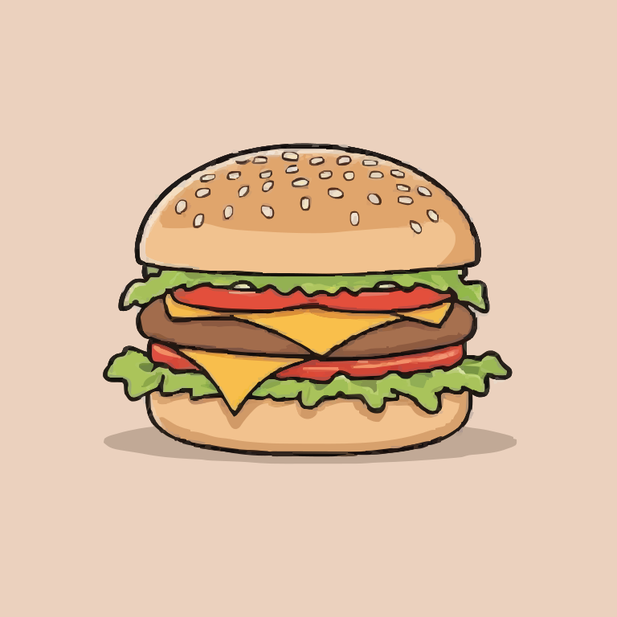
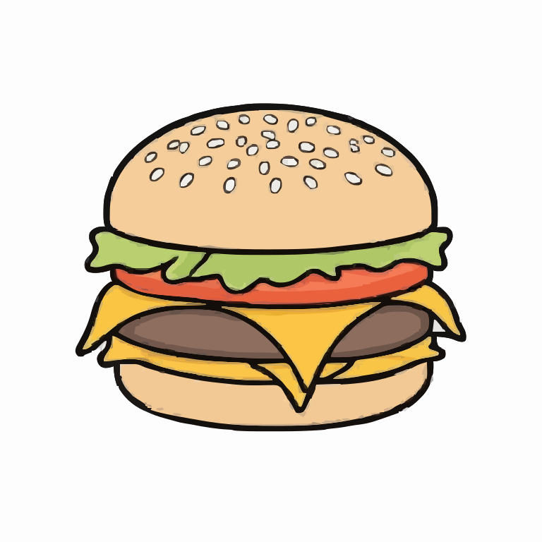

# Vecentor Generation Samples

## What is Vecentor? 

Vecentor is a revolutionary generative AI platform which allows you generate _Scalable Vector Graphics_ or _SVG_ using just a text prompt and your own imagination. 

## Samples 

    

    

## A sample with different sizes

    

    

    

    

    

    

